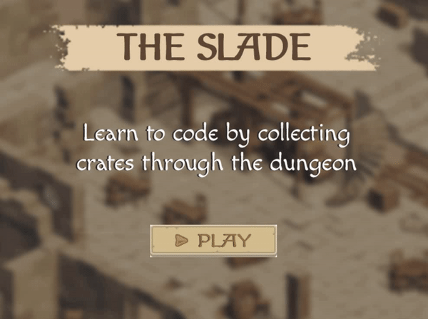

# The-Slade

### To run the game after downloading it, run the following commands

```
npm install
```

### There is also an dependency that is needed in order to run in the structure as is, or just by running
```
npm run start
```

### The dependency should be installed globally and it is the following
```
npm install -g parcel-bundler
```

### Small preview
